**Rangeland Data Processing Exercise **

**with Pix4D AND ArcGIS**

This exercise will introduce you to a variety of GIS tools that are frequently necessary to make your drone data collections more meaningful. In this exercise you will: 

* Explore Pix4D tools, 

* Combine image sets to render geopositioned orthomosaics and DEMs

* Explore common drone data specific GIS functions

* Conduct simple land cover classifications, and 

* Export a map. 

The data you will be using for this exercise will be provided in a .zip file at the workshop.  **Please unzip this file on your C:\ drive** for the file contents to function correctly.

Metadata (data about the data) is very important, and fortunately is partially generated during the early stages of most mosaic processes with the Pix4D software application, in the form of a report. Additional information that might be important, such as flight location, elevation, time and date, camera type, data type, etc. can be included as part of your file and directory naming conventions.  Please keep this in mind as you process and organize your data.

This exercise will be conducted in the Universal Transverse Mercator, Zone 10, coordinate system (using the WGS 84 datum).  The files that you will be using have already been saved in this coordinate system to avoid potential confusion.

You will be using imagery that was collected as part of a Rustici funded research project for developing best practices and protocols for rangeland monitoring.  The primary files you will use were collected on April 25, 2017 and consist of:

**DJI_X5 - DJI Zenmuse X5, 16mp, RGB, Orthomosaic Image and Digital Surface Model**, (TIFF - raster format). These files were generated from a collection of 407 images collected at 120m above ground level (AGL) with an 80% overlap, at the Yanci Ranch in Yolo County, situated in a mixed oak woodland and grassland. The spatial resolution of these images is approximately 1.39 in, and covers approximately 132 acres under the footprint of the flightlines. 

A smaller set of 61 images from this dataset have been prepared and pre-processed in Pix4D for you, because the original 407 image Pix4D project was too large for a workshop setting (~33.4GB).

Pix4D

## Add Data													

* Open Pix4D from the desktop icon, or by going to **_Start _***-> ***_All Programs_*** -> ***_Pix4D _***-> ***_Pix4Dmapper Pro_**  

* Create a new project

* Use the project wizard
to select a workspace for
your Pix4D project

* Follow the prompts (clicking **Next**) to select images for your project.

* Open the file browser to: 

**C:\DroneCamp\Drone_Projects\Rangeland\Rustici\Data\20170425_X5\Flight_2_1311_1323_400ft_80p**

Select all of the images and drag them over into the Select Images window, and click **Next**.

* Click the **To File…** option on the pop up window to export the drone image geotags to a .csv file.  You can use this file later to identify the footprint of the flight pattern. Click **OK **and **Next**.

* Accept the default Coordinate system

* Select **3D Maps** (if you have a fast computer) or **3D Maps – Rapid/Low Res** (if you have a medium to slow computer)

* **Do Not** check the Start Processing Now 
button

* Click **Finish**

* Click the **Processing Options** button, and explore the various tools that are available

* Under **3. DSM, Orthomosaic and Index** -> **Additional Outputs, **check the box for **LAS**

* Also check the box under 
**Raster DTM -> GeoTIFF**

* Click **OK**

* On the bottom portion of your screen,** u****ncheck ‘**2. Point Cloud and Mesh and 3. DSM, Orthomosaic and Index’, leaving **only** the **1.** **Initial Processing** button checked (not steps 2 and 3), and click **Start**

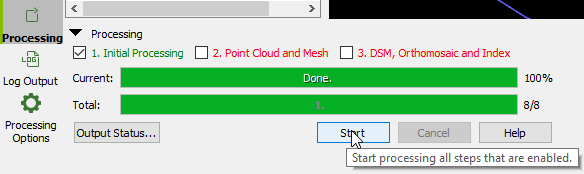

* When the Initial Processing is done, click the rayCloud option (on the left) and click the trackball navigation mode on the top of the screen

* Unclick the Cameras and Rays boxes

* Swivel the image around (clicking and dragging) until you are looking straight down on the point cloud 

See example ->

* Click on the Ground Control Point (GCP)/Manual Tie Points (MTP) Manager button at the top left of the screen

* Click **Import GCPs**

* Navigate to the following directory to find a set of GCPs for processing your imagery -  **C:\DroneCamp\Drone_Projects\Rangeland\Rustici\GPS****\
Trimble_GCPs_csv****
**

* Click **OK **and **OK **again**
**

* Expand the **GCPs/MTPs** in the layers window and click the various GCPs
(Note – The GCP’s will turn a lighter shade of blue when selected, and the selection will pop up in the window to the right)

* If the Selection doesn’t pop up on the right, click the box on the top right side to expand the selection properties window.

* Zoom in and out on the Image window and try to spot an unusually white dot in the area of the small blue circle.  When you find this white dot (being the actual GCP marker in the field) click the center of the dot and a yellow circle should appear around the GCP.

* Scroll down through the Images using the slider bar to the right to select the center of 3 more white GCP dots.  When you have selected 4 images points, for tie points, click **Apply**.

* Repeat this for all four of the GCPs (finding 2-5  image dots to tie to 4 total GCPs)

* When you are done, right click the remaining GCPs in the Layers window, and delete these GCPs, which do not have any tie points to the images.

The next steps for processing will take too long for most laptop computers, therefore this processing has already been done for you.  However if you were to complete this processing on your own, you would:

* Click the **Reoptimize** button at the top of the window and click **OK** for the warning

* Click Dismiss when it is done.

* Check steps 2 and 3 (Point Cloud and Mesh, and DSM, Orthomosaic and Index) and click Start.

This will take about 15 minutes on the fastest of Laptops, and 40+ minutes on average laptops.

* Close this session of Pix4D and open the pre-processed Pix4D project file located at
**C:\DroneCamp\Drone_Projects\Rangeland\Rustici\Data\20170425_X5\
Pix4D_Flight_2_1311_1323_400ft_80p.P4D
**

* Explore the project that you just created

ArcGIS Desktop

## Add Data													

* Open ArcMap 10 from the desktop icon, or by going to **_Start _***-> ***_All Programs_*** -> ***_ArcGIS _***-> ***_ArcMap_****..**  

* Click **_Cancel_**** **when the *Getting Started Window* appears to start with a "**_A New Empty Map_**" 

* Then, click on the **_Add Data_** button 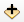

* In the Add Data window, click on the **_Connect To Folder_** button: 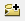

* Navigate to **C:\DroneCamp**, and click OK. The folder’s contents should then appear in the window (below).

 

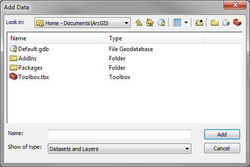 

* Click the **_Add_** button  , go to the following directory in the DroneCamp folder to add the Orthomosaic and elevation data that was created through the last steps.

**Orthomosaic:
**
C:\DroneCamp\Drone_Projects\Rangeland\Rustici\Data\20170425_X5\
Pix4D_Flight_2_1311_1323_400ft_80p\3_dsm_ortho\2_mosaic\
Pix4D_Flight_2_1311_1323_400ft_80p_transparent_mosaic_group1

The set of images that you used in the previous exercise session were part of a larger project

* Download the complete orthomosaic at:

C:\DroneCamp\Drone_Projects\Rangeland\Rustici\Data\20170425_X5\
Pix4D_1252_1340_400ft_80p_complete\3_dsm_ortho\2_mosaic\
pix4d_1252_1340_400ft_80p_transparent_mosaic_group1

and the corresponding surface model (**D****S****M**) at:

C:\DroneCamp\Drone_Projects\
Rangeland\Rustici\Data\20170425_X5\
Pix4D_1252_1340_400ft_80p_complete\
3_dsm_ortho\1_dsm\
pix4d_1252_1340_400ft_80p_dsm

**Explore the Main Menu drop down options.
**

* Explore the toolbar, including the zoom and pan tools, the identify tool, and the find tool to browse the data.  (Note – This toolbar may be docked horizontally across the top of the screen or vertically along the left side of the window)

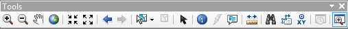

* Click the **_Customize_** 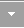* *drop down icon to see 
additional tool options that can be added to your 
toolbar.  

* Click the Commands tab, and type "**_Extract by Mask_**"
in the *Show commands containing*:  box.  By the time 
you get to “Extract by” the *Extract by Mask* tool should 
appear in your available commands window.  

* Click and drag this tool to dock it on your toolbar.

* You will have the opportunity to use the **_Extract by Mask_**** **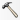** 
**tool in one of the next steps of the exercise.

The previous method for customizing your toolbars can save you a lot of time in the long run, if you find that you are repeatedly using the same tool over and over again.

Drone imagery commonly includes a considerable amount of data that is collected from outside of the footprint underneath the drone’s flight lines.  This data usually has the greatest amount of spectral and spatial distortion, which can decrease the quality of later map products. For this reason, you may wish to remove the distorted portions of the mosaic and DSM products.

* Again, click the **Add** button   , and add the Flight Geotags into the your ArcGIS session from:

C:\DroneCamp\Drone_Projects\Rangeland\Rustici\GIS\Vector\Geotags\GeoTags1

* Turn these files on and off in your table of contents, and rearrange the files by clicking and dragging them on top of each other.  Compare the file outputs from each of the sensors.

* Right click the flies to see their properties, including their source pathways.

* Slowly click them twice to rename the files; so that you don’t lose track of which file is associated with each sensor.

**Create a Shapefile from Scratch (Introduction to Arc Catalog)	****					**

Arc Catalog         , located on the top menu bar, is a very useful tool for organizing, renaming, creating and deleting files in ArcMap.  Unlike "Microsoft Windows" file directories, the Catalog shelters you from the enormous redundancy of like-named files that are only differentiated by their file extensions. 

* Click the          icon and navigate to your DroneCamp folder.  If your directory pathway is not already set up for Arc Catalog, click the *Connect To Folder* button        , just like you did at the very beginning of the exercise, and connect to your working folder.

* Right click the **_Boundary_** folder, click **_New_***,* and this time select **_Shapefile_**.

* Name the file **_Study_Outline_** and select 
**Polygon** as the Feature Type.

Designate a coordinate system for the shapefile:

* Click **_Edit…_*** *

* Navigate through the folders  Projected 
Coordinate Systems  UTM ->WGS 1984  Northern Hemisphere and select: 
**WGS 1984 UTM Zone 10N**

* Click **OK **and **OK**

You have now created a shapefile, however this file does not yet have any spatial features within it.

* Right Click a blank area somewhere on the top menu bar of the ArcMap window, and a long list of specialized tool bars will appear.  Select **_Editor, _**and the toolbar will appear somewhere on your ArcMap window.

* Click the Editor tab and select **Start Editing** from the drop down options.

* Select the newly created **_Study_Outline_** file -> Click **_OK_**** **-> and click **_Continue_**.

* Click the Create Features icon 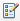 at the far right side of the Editor toolbar to begin creating the shape of the shapefile (see image on the next page).

* Click **_Study_Outline_** in the 
*Create Features* window, and 
select **_Polygon_**. 

* Click around the edge of the 
**GeoTags1**, so that it only covers the footprint under the cameras

* Under the Editor drop down tab, click **Save Edits** and click **Stop Editing.**

You have now created a shape file, which can be used to clip or extract data from other files, or be used to compute zonal statistics.

**Clip Raster Images****
**

* Click on the **Windows** tab and then -> **Search**, from the top menu bar. 

* Type "**Extract by Mask**" in the window, and click tool name in blue letters.  Alternatively, you can simply click the tool icon         that you previously added to your toolbar.

* Select the **Complete ****RGB** orthomosaic (**pix4d_1252_1340_400ft_80p_transparent_mosaic_group1**) from the first drop down arrow

* Select your **_Study_Outline_** area, from the second drop down arrow, and

Select an appropriate location in your DroneCamp GIS folder where you can save a clipped mosaic image, and then **stop**.  The processing time to complete this function will take several minutes and it is not essential right now.  However, because this is one of the most common geoprocessing tools needed for drone data, these directions are included.

Note – Sometimes the *Extract by Mask* tool doesn’t work.  If so, there is an alternative method to do the same thing.  Simply use the *ArcToolBox -> Data Management Tools -> Raster -> Raster Processing -> Clip* function instead.  Then use the *Study_Area* as the *Output Extent,* and be sure to click the *Use Input Feature for Clipping Geometry *box. 

**Raster Math and Topographic Modeling								****	**

Pix4D produces its output layers with all pixels in alignment.  Sometimes you will want to shift or warp these output layers at a later time (called georegistration or geocorrection), but you do not want to lose this important alignment between the layers in doing so.  Therefore it is usually a good idea to conduct all of your raster math and elevation modeling (e.g. for aspect, slope and hillshade) on the original files, and then create a single composite stack of the layers before you proceed. 

**Topographic Visualization**

* Use the Search function to look up and apply a Hillshade function to the DSM file.  Be sure save the output files to an appropriate location in your GIS folder.  Slope and aspect layers can be created in the same way.  For this exercise please use the defaults for these tools, these are for visualizations only.

* When the Hillshade appears in the Table of Contents -> right click it -> select **Properties **-> click the Display tab -> and enter 50% for transparency.

* Place this on top of the DSM in the TOC, for design effect.

**Bonus Exercise - Stream Delineation 

**(for more advanced users)

**New GIS users, please skip to after the boxed 

in text areas**

* Click the Model Builder tool at the top of the screen. 

Unless you have an extremely fast computer for this exercise you will probably want to use the smaller dataset that you processed in the Pix4D at the beginning of the exercise.  Browse through the following folder using the file structure knowledge that you have developed over the course of this session:   

C:\DroneCamp\Drone_Projects\Rangeland\Rustici\Data\20170425_X5\
Pix4D_Flight_2_1311_1323_400ft_80p

* Click and drag the DSM or DTM from the TOC into the Model Builder window at the top left.

* Use the Search tool to look up ‘**Fill**’, and then drag and drop the Fill function into the Model Builder, right after the DSM bubble.

* Click the Connect 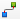tool to link the DSM to Fill, and click **Input Service Raster**

* In a chain search for and connect **Flow Direction** -> **Flow Accumulation** -> and **Reclassify**  

A diagram of this model can be found on the next page

* Select the pointer button 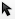 on the Model Builder toolbar, and double click the first green circle in the series of function outputs -> select an appropriate place in your directory to send this file output (e.g. a trash folder - these files won’t be used again) -> then repeat this for each of the other green bubbles. 

* Run the model by clicking the Run arrow 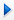 on the toolbar.  This step was taken to prepare the model for the final processing steps.**
**

* Now add **Extract by Attributes** -> and **Raster to Polyline** to the end of the model tools.

* Double click on **Reclassify** -> change the first class category to run from **0 - 25,000** and change the New Value to **0**.  

* Change the second class to **25,000 - 9,999,999,999 **(a very large number) and its New Value as** 1**

* Use tab and delete to remove all of the other class values (we only want 2 classes)

* Double click the **Extract by Attributes** box, and under the where clause, enter **Value = 1   **(your reclassified output should be the default for the input)

* Double click all of the boxes and bubbles to make sure that the file pathways are correctly set up.

* Click the Run Button again and when it finishes running, load the new stream network file into your ArcGIS session.

**Composite Bands**

* For the sake of processing time in the next steps, load the reduced size **DSM** and **DTM** files from the directory created in the first Pix4D section of this exercise:  

C:\DroneCamp\Drone_Projects\Rangeland\Rustici\Data\20170425_X5\
Pix4D_Flight_2_1311_1323_400ft_80p

	**Hint **- In your windows file browser, you can use the search box at the top right corner of the browser (or control+F) to look up the DSM and/or DTM files.  The **.tif **files found in the windows browser can then be dragged and dropped into the ArcGIS Table of Contents.

* Using the ArcGIS search function, type **Composite Bands**, and click the blue Composite Bands (Data Management) (Tool) option.  

* Add your reduced size **orthomosaic**, **DSM**, **DTM**, as well as the **Hillshade**, **Slope**, Aspect any other layers from the larger dataset as Input Rasters 

If you suspect that you might ever want to conduct further analysis using your DSM or DTM files again, there is an extra step that you need to take here.  

* Click the *Environments…* button at the bottom of the *Composite Bands* window -> expand *Raster Storage* (near the bottom of the list) -> scroll further down and under *Resample*, select BILINEAR, and click OK.

Before you run the Band Composite tool, you may want to write down the order of your layers, or take a screen capture of the file order for future reference. 

* Enter an appropriate output location for your ‘Layer_Stack’ and don’t forget the extension (i.e. .tif) click **OK** to execute the Band Composite tool.

* Click the Environments button at the bottom of the Composite Bands window -> expand Processing extent (the 3rd option down), from the dropdown under extent, select **Same as **‘your orthomosaic image’

*  Then under Snap Raster, select the orthomosaic file again.

* click **OK** to execute the Band Composite tool.

These steps will ensure that your raster pixels will be in perfect alignment in the output layer stack.

The layer stack will show up in your Table of Contents, but will have a strange color composite of the three input layers.  Right click the file in the *Table of Contents* -> select *Properties *-> click the *Symbology *tab →  Stretched→ Pick a color → Apply Stretch Type → Percent Clip

**Classification	****											****	**

Classification is a powerful tool for automatically symbolizing land cover characteristics, that can then be displayed on a map for a desired impact.  For this we will use ArcGIS’s **_Image Classification_** tool.

* Right click a blank area at the top of the ArcGIS window, click **_Image Classification _**from the drop down options.

* Use the Zoom and Pan tools to focus on different areas in your Layer_Stack that have relatively uniform examples of **bright vegetation (yellow star thistle), dark vegetation (grass), and stressed vegetation/bare earth **

Frequently this type of classification training data would be collected in the field using a GPS, however we will conduct "heads up digitization" (i.e. traced outlines of the land cover sample sites).  For this just use your best judgement as to the color and brightness of the RGB imagery.

* Select the **Layer_Stack **file from the drop down list:

* Click the Training **_Sample Manager_** icon 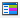  and then click the **_Draw Polygon_** icon  on the Image Classification bar.

* Begin clicking on the map window to select/outline three **bright vegetation** regions of interest (ROI), double click when you are ready to finish the sketch.  

* If the shapes you just created are a good representative example of healthy vegetation, select all of them by using **Ctrl** click in the Training Sample Manager, and then click the **_Merge training samples_**       icon 

* Repeat the above steps to next collect 3 ROIs for each of the following types of land cover: **dark vegetation, and stressed vegetation/bare earth**; merging them into
a single class after each set of 3 ROIs are collected.

Don’t rush while using the Image Classification tools, and save your work frequently.  The classification tools are sometimes touchy and can cause ArcGIS to crash.

* In the Training Sample Manager window, click the **_Create a signature file_** icon        and save your signature file to your working directory, with a name of your choosing.

* In the Classification toolbar click the drop down pointer and select **Maximum Likelihood Classification **as your classification method.

    * Your **_Layer_Stack_** image should already 
be listed in input raster bands list.

* Track down and select the **_Input signature_** 
file that you just created by clicking the file icon 

* Select an appropriate location to save your 
**_Output classified raster_** and call it **_LC_Classes_**

* Leave all the other default setting as they are, and click **_OK_**

* It may take a couple minutes, but eventually a classified image of your study area should appear.

**Create a map	****					**							

Switch over to **_Layout View_**, by either clicking on the little icon for the Layout View on the bottom-left of your map window              , or by going to the **_View_** menu tab and selecting **_Layout View_**.

Notice that your Layout Toolbar is automatically added. The Layout Toolbar has navigation tools (zooming, panning, etc.) **_for the layout map, _****_not_****_ the data view map._** This is the big difference between the data tools and the layout tools. This can take some getting used to at first: you use the data tools in the data view, and the layout tools in the layout view.

* Insert Text (a **Title**), a **Legend**, a **North Arrow**, **etc.** from the **_Insert_** menu tab drop down list.

Note: ArcMap places your map elements in the center of your map at first, and you have to move them to where you want.  Look carefully when you’ve added an element – sometimes it’s hard to see them in front of your map!  

* Use the pointer icon          to select elements on the layout view of the map.  Use it to right click the map area to align and fit the map to its margins.

The legend is automatically linked to the layer names and displayed symbology.  Sometimes you will wish to change the layout of the legend.  

* Using the pointer tool, right click the legend and Convert it to Graphics, then Ungroup the legend until you can access the specific text or elements that you want to change (by double clicking them).

**Export your map****												**

* Go to the **_File_**** **menu *→** ***_Export Map_***...* and change the "**_Save as type_**" to **PDF**. Use a unique name, with your name in the name.

* Click "**_Options_***…*" to change the output resolution.  300dpi is a high quality output resolution for printing (below).

Thank you for attending the first IGIS DroneCamp!             

