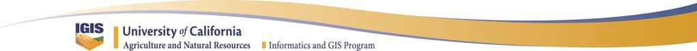

**Rangeland Data Processing
Exercise **

**with Pix4D AND ArcGIS
Pro**

This exercise will introduce you to a variety of GIS tools that are
frequently necessary to make your drone data collections more
meaningful. In this exercise you will:

-   Explore Pix4D tools,

-   Combine image sets to render geopositioned orthomosaics and DEMs

-   Explore common drone data specific GIS functions

-   Conduct simple land cover classifications, and

-   Export a map.

The data you will be using for this exercise will be provided in a .zip
file at the workshop. **Please unzip this file on your C:\\ drive** for
the file contents to function correctly.

Metadata (data about the data) is very important, and fortunately is
partially generated during the early stages of most mosaic processes
with the Pix4D software application, in the form of a report. Additional
information that might be important, such as flight location, elevation,
time and date, camera type, data type, etc. can be included as part of
your file and directory naming conventions. Please keep this in mind as
you process and organize your data.

This exercise will be conducted in the Universal Transverse Mercator,
Zone 10, coordinate system (using the WGS 84 datum). The files that you
will be using have already been saved in this coordinate system to avoid
potential confusion.

You will be using imagery that was collected as part of a Rustici funded
research project for developing best practices and protocols for
rangeland monitoring. The primary files you will use were collected on
April 25, 2017 and consist of:

> **DJI\_X5 - DJI Zenmuse X5, 16mp, RGB, Orthomosaic Image and Digital
> Surface Model**, (TIFF - raster format). These files were generated
> from a collection of 407 images collected at 120m above ground level
> (AGL) with an 80% overlap, at the Yanci Ranch in Yolo County, situated
> in a mixed oak woodland and grassland. The spatial resolution of these
> images is approximately 1.39 in, and covers approximately 132 acres
> under the footprint of the flightlines.
>
> A smaller set of 61 images from this dataset have been prepared and
> pre-processed in Pix4D for you, because the original 407 image Pix4D
> project was too large for a workshop setting (\~33.4GB).

Pix4D

Add Data 
---------

-   Open Pix4D from the desktop icon, or by going to ***Start** -&gt;
    **All Programs** -&gt; **Pix4D** -&gt; **Pix4Dmapper Pro***\
    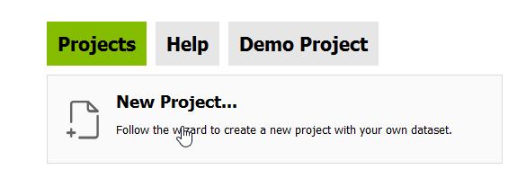

-   Create a new project\
    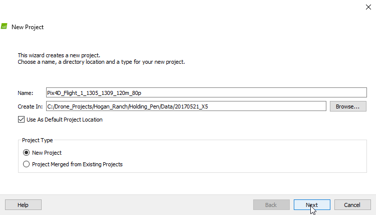

-   Use the project wizard\
    to select a workspace for\
    your Pix4D project

-   Follow the prompts (clicking **Next**) to select images for your
    project.

-   Open the file browser to:\
    \
    **C:\\DroneCamp\\Drone\_Projects\\Rangeland\\Rustici\\Data\\20170425\_X5\\Flight\_2\_1311\_1323\_400ft\_80p**\
    \
    Select all of the images and drag them over into the Select Images
    window, and click **Next**.\
    \
    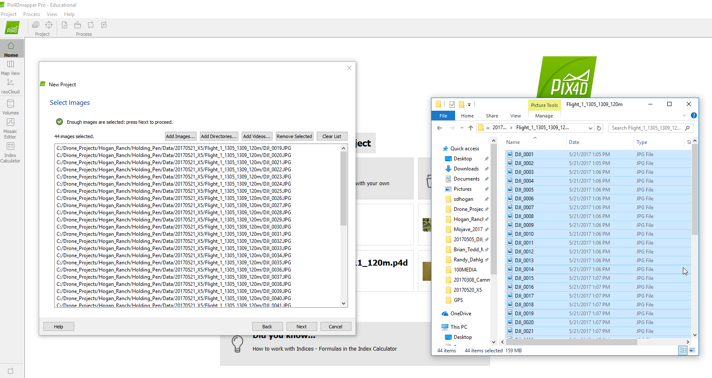

-   Click the **To File…** option on the pop up window to export the
    drone image geotags to a .csv file. You can use this file later to
    identify the footprint of the flight pattern. Click **OK** and
    **Next**.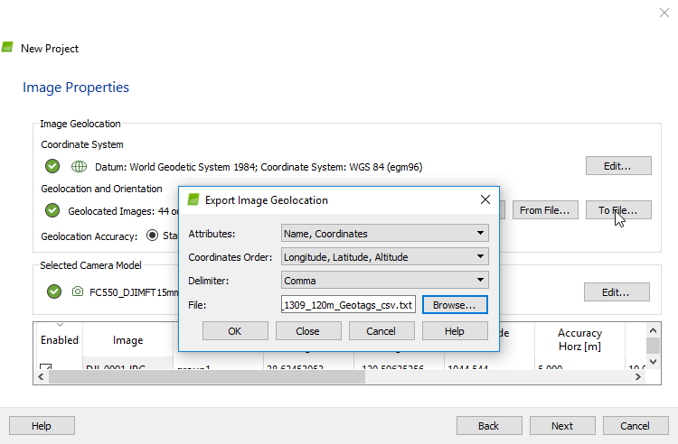

<!-- -->

-   Accept the default Coordinate system

-   Select **3D Maps** (if you have a fast computer) or **3D Maps –
    Rapid/Low Res** (if you have a medium to slow computer)\
    \
    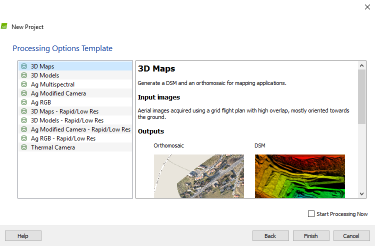

-   ***Do Not*** check the Start Processing Now\
    button

-   Click **Finish**

-   Click the **Processing Options** button, and explore the various
    tools that are available

-   Under **3. DSM, Orthomosaic and Index** -&gt; **Additional
    Outputs,** check the box for
    **LAS**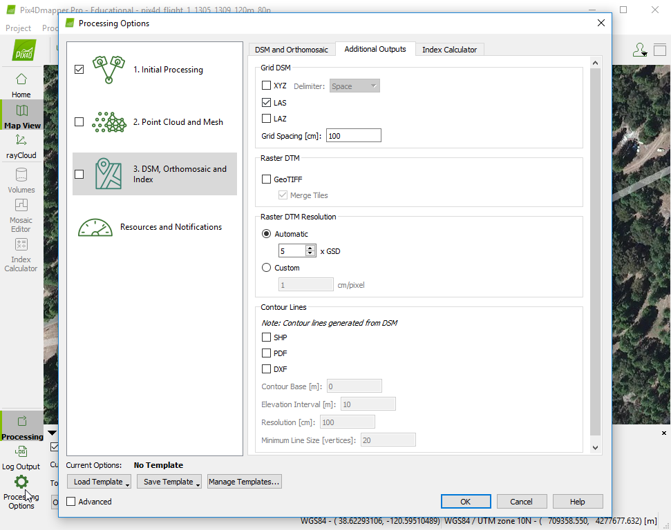

-   Also check the box under\
    **Raster DTM -&gt; GeoTIFF**

-   Click **OK**

-   On the bottom portion of your screen, **uncheck ‘**2. Point Cloud
    and Mesh and 3. DSM, Orthomosaic and Index’, leaving ***only*** the
    **1.** **Initial Processing** button checked (not steps 2 and 3),
    and click **Start**\
    \
    

-   When the Initial Processing is done, click the rayCloud option (on
    the left) and click the trackball navigation mode on the top of the
    screen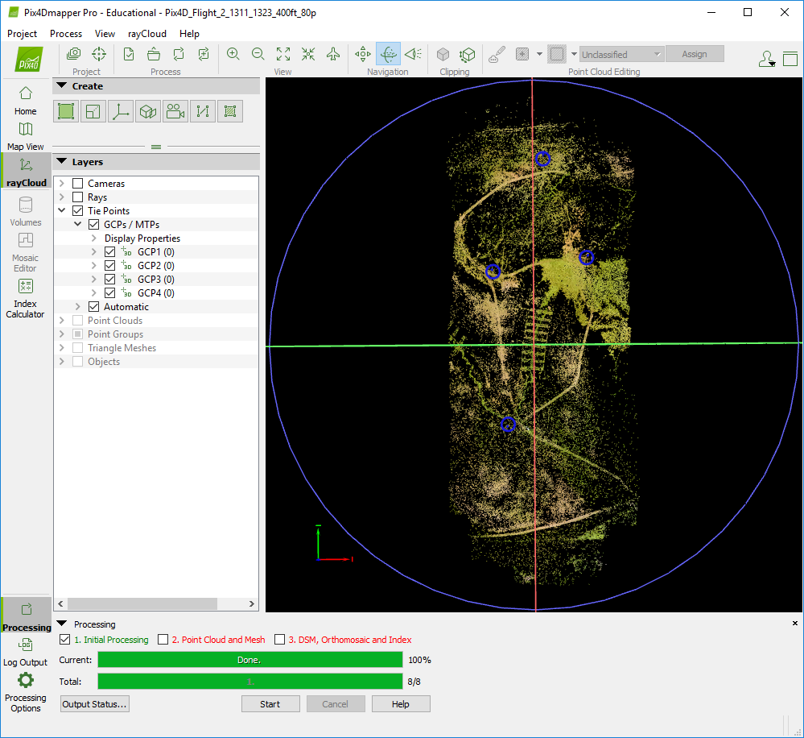

-   Unclick the Cameras and Rays boxes

-   Swivel the image around (clicking and dragging) until you are
    looking straight down on the point cloud

> See example -&gt;

-   Click on the Ground Control Point (GCP)/Manual Tie Points (MTP)
    Manager button at the top left of the screen\
    \
    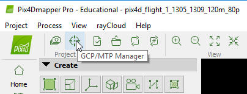

-   Click **Import GCPs**

-   Navigate to the following directory to find a set of GCPs for
    processing your imagery -
    **C:\\DroneCamp\\Drone\_Projects\\Rangeland\\Rustici\\GPS\\\
    Trimble\_GCPs\_csv\
    **

-   Click **OK** and **OK** again**\
    **

-   Expand the **GCPs/MTPs** in the layers window and click the various
    GCPs\
    (Note – The GCP’s will turn a lighter shade of blue when selected,
    and the selection will pop up in the window to the right)

-   If the Selection doesn’t pop up on the right, click the box on the
    top right side to expand the selection properties window.\
    \
    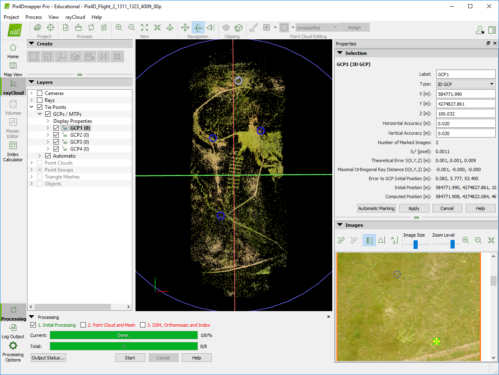

-   Zoom in and out on the Image window and try to spot an unusually
    white dot in the area of the small blue circle. When you find this
    white dot (being the actual GCP marker in the field) click the
    center of the dot and a yellow circle should appear around the GCP.\
    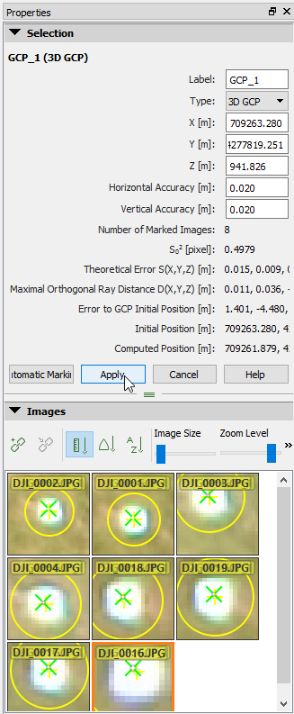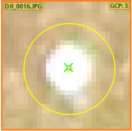

-   Scroll down through the Images using the slider bar to the right to
    select the center of 3 more white GCP dots. When you have selected 4
    images points, for tie points, click **Apply**.

-   Repeat this for all four of the GCPs (finding 2-5 image dots to tie
    to 4 total GCPs)

-   When you are done, right click the remaining GCPs in the Layers
    window, and delete these GCPs, which do not have any tie points to
    the images.

The next steps for processing will take
too long for most laptop computers, therefore this processing has
already been done for you. However if you were to complete this
processing on your own, you would:

-   Click the **Reoptimize** button at the top of the window and click
    **OK** for the warning\
    \
    

-   Click Dismiss when it is done.

-   Check steps 2 and 3 (Point Cloud and Mesh, and DSM, Orthomosaic and
    Index) and click Start.\
    \
    This will take about 15 minutes on the fastest of Laptops, and 40+
    minutes on average laptops.

-   Close this session of Pix4D and open the pre-processed Pix4D project
    file located at\
    **C:\\DroneCamp\\Drone\_Projects\\Rangeland\\Rustici\\Data\\20170425\_X5\\\
    Pix4D\_Flight\_2\_1311\_1323\_400ft\_80p.P4D\
    **

-   Explore the project that you just created

ArcGIS Pro

Add Data 
---------

-   Open ArcGIS Pro from the desktop icon, or by going to ***Start**
    -&gt; **All Programs** -&gt; **ArcGIS** -&gt; **ArcGIS Pro*****..**

-   Select ***Blank*** under “***Create a New Project***” and give your
    project an appropriate name

-   Click the ***New Map*** button
    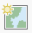

<!-- -->

-   Click the ***Add Data*** button
    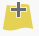 , go to the following directory in
    the DroneCamp folder to add the Orthomosaic and elevation data that
    was created through the last steps.

> **Orthomosaic:\
> **\
> C:\\DroneCamp\\Drone\_Projects\\Rangeland\\Rustici\\Data\\20170425\_X5\\\
> Pix4D\_Flight\_2\_1311\_1323\_400ft\_80p\\3\_dsm\_ortho\\2\_mosaic\\\
> Pix4D\_Flight\_2\_1311\_1323\_400ft\_80p\_transparent\_mosaic\_group1

The set of images that you used in the previous exercise session were
part of a larger project

-   Download the complete orthomosaic at:

> C:\\DroneCamp\\Drone\_Projects\\Rangeland\\Rustici\\Data\\20170425\_X5\\\
> Pix4D\_1252\_1340\_400ft\_80p\_complete\\3\_dsm\_ortho\\2\_mosaic\\\
> pix4d\_1252\_1340\_400ft\_80p\_transparent\_mosaic\_group1\
> \
> 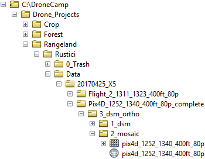
>
> and the corresponding surface model (**DSM**) at:
>
> C:\\DroneCamp\\Drone\_Projects\\\
> Rangeland\\Rustici\\Data\\20170425\_X5\\\
> Pix4D\_1252\_1340\_400ft\_80p\_complete\\\
> 3\_dsm\_ortho\\1\_dsm\\\
> pix4d\_1252\_1340\_400ft\_80p\_dsm

**Explore the Main Menu drop down options.\
**

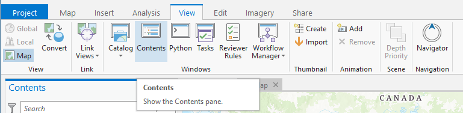

-   Click the Analysis tab and the Tools icon
    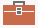, and type “***Extract by Mask***” in
    the Geoprocessing search bar. By the time\
    you get to “Extract by” the *Extract by Mask* tool should\
    appear in your Search Reults window.

-   Right click and choose “*Add To Analysis Gallery”*.

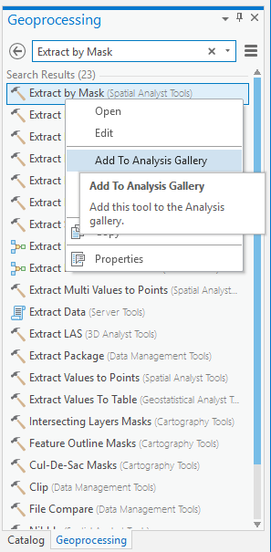

-   You will have the opportunity to use the ***Extract by Mask***
    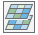 **\
    **tool in one of the next steps of the exercise.

> The previous method for customizing your toolbars can save you a lot
> of time in the long run, if you find that you are repeatedly using the
> same tool over and over again.
>
> Drone imagery commonly includes a considerable amount of data that is
> collected from outside of the footprint underneath the drone’s flight
> lines. This data usually has the greatest amount of spectral and
> spatial distortion, which can decrease the quality of later map
> products. For this reason, you may wish to remove the distorted
> portions of the mosaic and DSM
> products.

-   Again, click the **Add** button
     , and add the Flight Geotags into
    your ArcGIS Pro session from:\
    \
    C:\\DroneCamp\\Drone\_Projects\\Rangeland\\Rustici\\GIS\\Vector\\Geotags\\GeoTags1

<!-- -->

-   []{#_gjdgxs .anchor}Turn these files on and off in your table of
    contents, and rearrange the files by clicking and dragging them on
    top of each other. Compare the file outputs from each of the
    sensors.

-   Right click the flies to see their properties, including their
    source pathways.

-   Slowly click them twice to rename the files; so that you don’t lose
    track of which file is associated with each sensor.

***Create a Shapefile from Scratch ***

-   Click the Tools
     icon and type “***Create Feature
    Class***” into the Geoprocessing search bar. Under “*Feature Class
    Location*” navigate to your DroneCamp folder and select the
    ***Boundary*** folder.

-   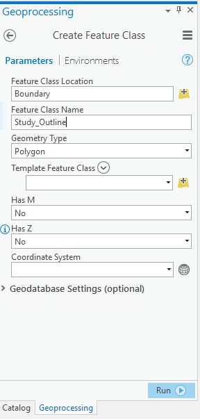Name the file ***Study\_Outline*** and
    select\
    **Polygon** as the Geometry Type.

> Designate a coordinate system for the shapefile:

-   Click ***Select coordinate system***
    

-   Navigate through the folders: Projected\
    Coordinate Systems -&gt; UTM -&gt;WGS 1984 -&gt; Northern Hemisphere
    and select:\
    **WGS 1984 UTM Zone 10N**

-   Click **OK** and **Run**

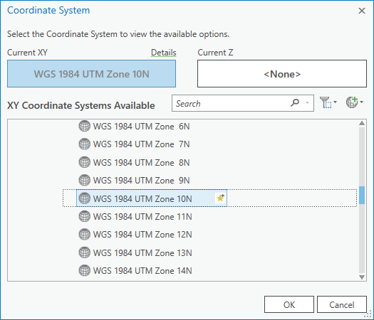

You have now created a shapefile, however this file does not yet have
any spatial features within it.

-   Click the Edit tab, then click the Create icon
     to begin creating the shape of the
    shapefile (see image on the next page).

-   Click ***Study\_Outline*** in the\
    *Create Features* window, and\
    select ***Polygon***.

> 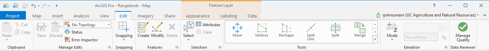

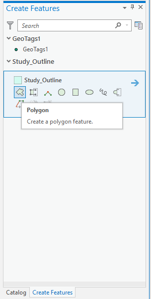

> 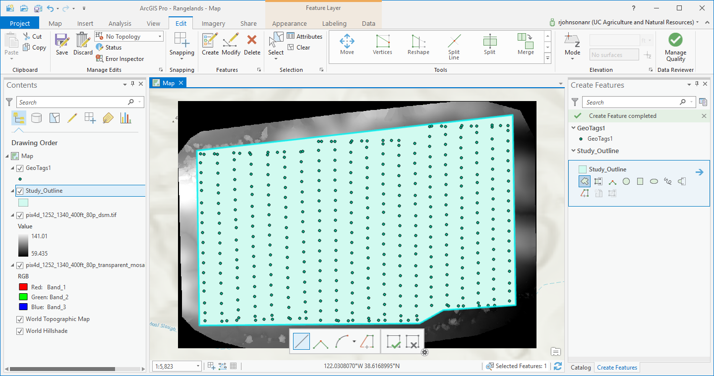

-   Click around the edge of the\
    **GeoTags1**, so that it only covers the footprint under the cameras

-   Under the Editor tab, click **Save Edits.**

> You have now created a shape file, which can be used to clip or
> extract data from other files, or be used to compute zonal
> statistics.

***Clip Raster Images\
***

-   Click on the **Analysis** tab and then the **Tools** icon
    .

-   Type “**Extract by Mask**” in the
    Geoprocessing window, and click tool. Alternatively, you can simply
    click the tool icon that you previously added to your tool gallery.

-   Select the **Complete RGB** orthomosaic
    (**pix4d\_1252\_1340\_400ft\_80p\_transparent\_mosaic\_group1**)
    from the first drop down arrow

-   Select your ***Study\_Outline*** area, from the second drop down
    arrow, and

> Select an appropriate location in your DroneCamp GIS folder where you
> can save a clipped mosaic image, and then **stop**. The processing
> time to complete this function will take several minutes and it is not
> essential right now. However, because this is one of the most common
> geoprocessing tools needed for drone data, these directions are
> included.
>
> Note – Sometimes the *Extract by Mask* tool doesn’t work. If so, there
> is an alternative method to do the same thing. Simply use the
> *ArcToolBox -&gt; Data Management Tools -&gt; Raster -&gt; Raster
> Processing -&gt; Clip* function instead. Then use the *Study\_Area* as
> the *Output Extent,* and be sure to click the *Use Input Feature for
> Clipping Geometry* box. 

***Raster Math and Topographic Modeling ***

Pix4D produces its output layers with all pixels in alignment. Sometimes
you will want to shift or warp these output layers at a later time
(called georegistration or geocorrection), but you do not want to lose
this important alignment between the layers in doing so. Therefore, it
is usually a good idea to conduct all of your raster math and elevation
modeling (e.g. for aspect, slope and hillshade) on the original files,
and then create a single composite stack of the layers before you
proceed.

**Topographic Visualization**

-   Use the Search function to look up and apply a Hillshade function to
    the DSM file. Be sure save the output files to an appropriate
    location in your GIS folder. Slope and aspect layers can be created
    in the same way. For this exercise please use the defaults for these
    tools, these are for visualizations only.

<!-- -->

-   When the Hillshade appears in the Contents pane -&gt; click it -&gt;
    select **Appearance** under the “Raster Layer” section of the
    toolbar -&gt; adjust the transparency slider to 50%.

-   Place this on top of the DSM in the TOC, for design effect.

**Bonus Exercise - Stream Delineation\
\
**(for more advanced users)

> **New GIS users, please skip to after the boxed in text areas**

-   Click the Model Builder tool at the top of the screen under
    **Analysis**.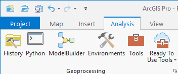

> Unless you have an extremely fast computer for this exercise you will
> probably want to use the smaller dataset that you processed in the
> Pix4D at the beginning of the exercise. Browse through the following
> folder using the file structure knowledge that you have developed over
> the course of this session:\
> \
> C:\\DroneCamp\\Drone\_Projects\\Rangeland\\Rustici\\Data\\20170425\_X5\\\
> Pix4D\_Flight\_2\_1311\_1323\_400ft\_80p
-   Click and drag the DSM or DTM from the TOC into the Model Builder
    window at the top left.

-   Use the Search tool to look up ‘**Fill**’, and then drag and drop
    the Fill function into the Model Builder, right after the DSM
    bubble.

-   Click and hold the DSM, drag the arrow to Fill, and click **Input
    Service Raster**

<!-- -->

-   In a chain search for and connect **Flow Direction** -&gt; **Flow
    Accumulation** -&gt; and **Set Null**

A diagram of this model can be found on the next page

-   Double click the first green circle in the series of function
    outputs -&gt; select an appropriate place in your directory to send
    this file output (e.g. a trash folder - these files won’t be used
    again) -&gt; then repeat this for each of the other green bubbles.

-   Run the model by clicking the Run arrow
    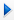 on the toolbar. This step was taken
    to prepare the model for the final processing steps.**\
    **

-   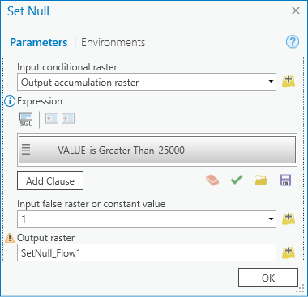Now add **Stream to Feature** to the
    end of the model tools.

-   Double click on **Set Null**-&gt; change the SQL expression to
    **VALUE &gt; 25000**

-   Set the constant value to **1**

<!-- -->

-   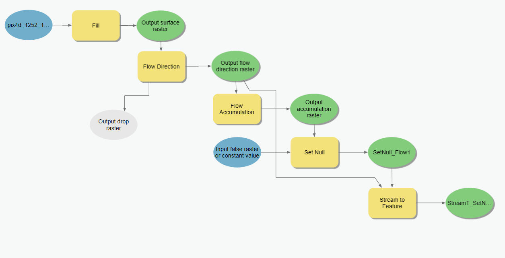Click the Run Button
    ![]image35.png)again and when it finishes running,
    load the new stream network file into your ArcGIS session.

**Composite Bands**

-   For the sake of processing time in the next steps, load the reduced
    size **DSM** and **DTM** files from the directory created in the
    first Pix4D section of this exercise:\
    \
    C:\\DroneCamp\\Drone\_Projects\\Rangeland\\Rustici\\Data\\20170425\_X5\\\
    Pix4D\_Flight\_2\_1311\_1323\_400ft\_80p

> **Hint** - In your windows file browser, you can use the search box at
> the top right corner of the browser (or control+F) to look up the DSM
> and/or DTM files. The **.tif** files found in the windows browser can
> then be dragged and dropped into the ArcGIS Pro Contents pane.

-   Using the ArcGIS search function, type **Composite Bands**, and
    click the Composite Bands (Data Management) (Tool) option.

<!-- -->

-   Add your reduced size **orthomosaic**, **DSM**, **DTM**, as well as
    the **Hillshade**, **Slope**, Aspect any other layers from the
    larger dataset as Input Rasters

If you suspect that you might ever want to
conduct further analysis using your DSM or DTM files again, there is an
extra step that you need to take here.

-   Click the *Environments…* tab at the top of the *Composite Bands*
    window, at the bottom of the list under *Resample* select BILINEAR.

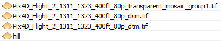

> Before you run the Band Composite tool, you may want to write down the
> order of your layers, or take a screen capture of the file order for
> future reference.

-   Enter an appropriate output location for your ‘Layer\_Stack’ and
    don’t forget the extension (i.e. .tif).

<!-- -->

-   Click the Environments tab at the top of the Composite Bands window
    and from the dropdown under Extent, select **Same as** ‘your
    orthomosaic image’

-   Then under Snap Raster, select the orthomosaic file again.

-   Click **Run** to execute the Band Composite tool.

These steps will ensure that your raster pixels will be in perfect
alignment in the output layer stack.

> The layer stack will show up in your Contents pane, but will have a
> strange color composite of the three input layers. Right click the
> file in the *Contents pane* -&gt; select *Symbology* -&gt; Stretched→
> Pick a color → Apply Stretch Type → Percent
> Clip

***Classification ***

Classification is a powerful tool for automatically symbolizing land
cover characteristics, that can then be displayed on a map for a desired
impact. For this we will use ArcGIS Pro’s ***Image Classification***
tools.

-   Click ***Classification Tools*** under the Imagery tab and select
    ***Training Samples Manager*** from the drop down menu.

-   Use the Zoom and Pan tools to focus on different areas in your
    Layer\_Stack that have relatively uniform examples of **bright
    vegetation (yellow star thistle), dark vegetation (grass), and
    stressed vegetation/bare earth**

-   Within the ***Training Samples Manager*** window, select Create New
    Schema 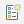

-   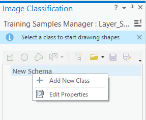Right click the “New Schema” heading
    and select Add New Class

-   Give your new class a name (Yellow Star Thistle) and a value (1)

> Frequently this type of classification training data would be
> collected in the field using a GPS, however we will conduct “heads up
> digitization” (i.e. traced outlines of the land cover sample sites).
> For this just use your best judgement as to the color and brightness
> of the RGB imagery.

-   Select your new class in the ***Training Samples Manager*** and
    click the ***Polygon*** icon
    .

-   Begin clicking on the map window to select/outline three **bright
    vegetation** regions of interest (ROI), double click when you are
    ready to finish the sketch.

-   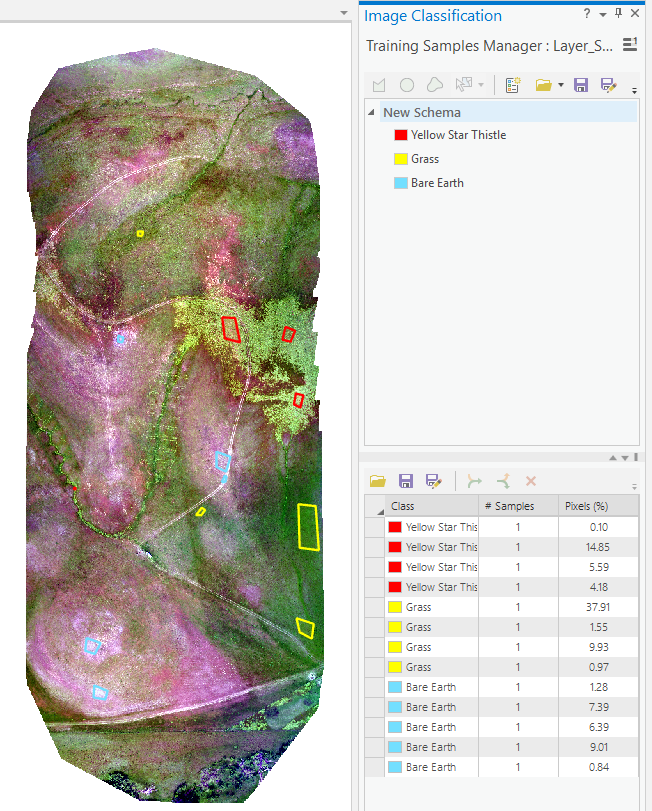Repeat the above steps to next collect
    3 ROIs for each of the following types of land cover: **dark
    vegetation, and stressed vegetation/bare earth**.

> Don’t rush while using the Image Classification tools, and save your
> work frequently. The classification tools are sometimes touchy and can
> cause ArcGIS to crash.

-   In the Training Samples Manager window, click ***Save*** and save
    your training samples to your working directory, with a name of your
    choosing.

-   In the Imagery tab click the ***Classification Tools*** and
    ***Classify*** and select **Maximum Likelihood Classification** as
    your classification method.

-   !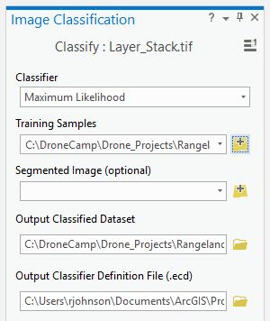Track down and select the ***Training
    Samples***\
    file that you just created

-   Select an appropriate location to save your\
    ***Output classified dataset*** and call it ***LC\_Classes***

-   Leave all the other default setting as they are, and click ***Run***

-   It may take a couple minutes, but eventually a classified image of
    your study area should appear.

***Create a map** \_\_\_\_\_\_\_\_\_\_\_\_*

Within the Insert tab, select ***New Layout*** and then select “Letter”
under ANSI Portrait.

-   Insert Text (a **Title**), a **Legend**, a **North Arrow**, **etc.**
    from the ***Insert*** menu tab drop down list.

Note: ArcMap places your map elements in the center of your map at
first, and you have to move them to where you want. Look carefully when
you’ve added an element – sometimes it’s hard to see them in front of
your map!

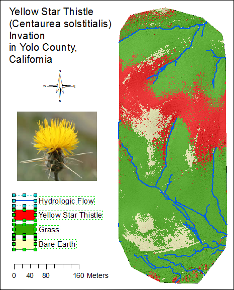

The legend is automatically linked to the layer names and displayed
symbology. Sometimes you will wish to change the layout of the legend.

-   Right click the legend and Convert it to Graphics, then Ungroup the
    legend until you can access the specific text or elements that you
    want to change (by double clicking them).

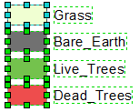

***Export your map ***

-   Go to the ***Share* tab** *→ **Export
    Layout**...* and change the “***Save as type***” to **PDF**. Use a
    unique name, with your name in the name.

-   Change the output resolution. 300dpi is a high quality output
    resolution for printing (below).

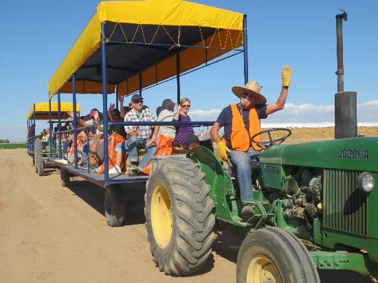

> Thank you for attending the first IGIS DroneCamp!
